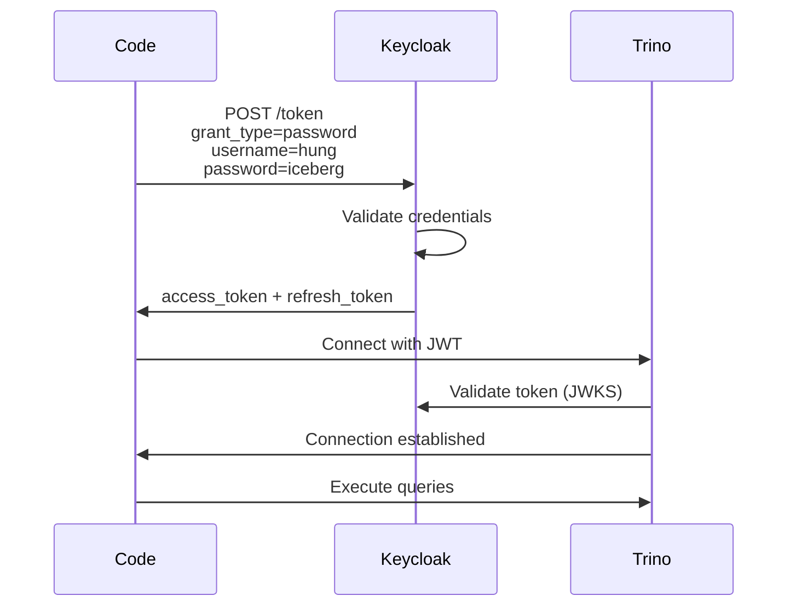
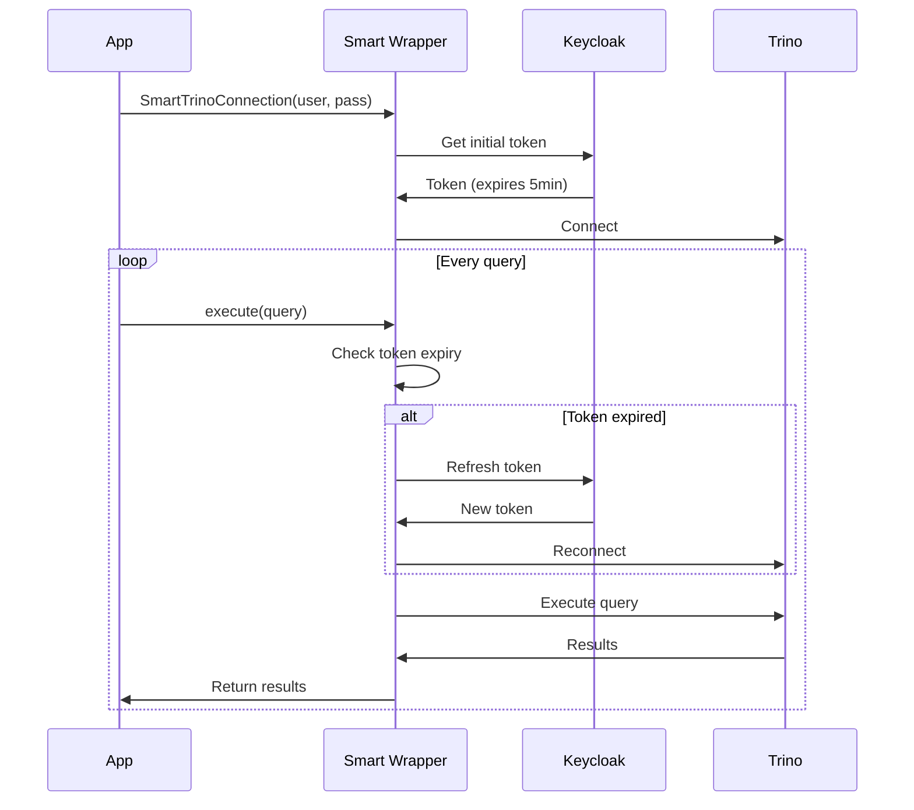

# Trino Authentication Options - Programmatic Access

## 📋 Tổng quan

Document này so sánh các cách authenticate đến Trino mà **KHÔNG** cần browser interaction.

---

## 🔄 So sánh Options

| Feature              | Authorization Code Flow<br/>(Hiện tại) | ROPC Grant<br/>(Option 1) | Client Credentials<br/>(Option 2) | Smart Wrapper<br/>(Option 3) |
| -------------------- | -------------------------------------- | ------------------------- | --------------------------------- | ---------------------------- |
| **Browser Required** | ✅ Yes                                 | ❌ No                     | ❌ No                             | ❌ No                        |
| **User Credentials** | Interactive                            | Hardcoded                 | N/A (service account)             | Hardcoded + Auto refresh     |
| **Security Level**   | 🟢 High                                | 🟡 Medium                 | 🟢 High                           | 🟡 Medium                    |
| **Use Case**         | Web UI, interactive                    | Scripts, notebooks        | Service-to-service                | Long-running apps            |
| **Token Management** | Manual                                 | Manual                    | Manual                            | **Automatic** ✨             |
| **Complexity**       | 🔴 High                                | 🟢 Low                    | 🟡 Medium                         | 🟡 Medium                    |
| **Production Ready** | ✅ Yes                                 | ⚠️ Internal only          | ✅ Yes                            | ✅ Yes                       |

---

## ✅ Option 1: ROPC Grant (Khuyến nghị cho notebooks/scripts)

### Ưu điểm:

- ✅ Đơn giản, dễ implement
- ✅ Không cần browser
- ✅ Phù hợp notebooks, scripts, automation
- ✅ Vẫn authenticate bằng user credentials (audit trail rõ ràng)

### Nhược điểm:

- ⚠️ Credentials hardcoded trong code (security risk)
- ⚠️ Không recommend cho production public apps
- ⚠️ OAuth2 spec không khuyến khích (legacy grant type)

### Setup:

```bash
# 1. Enable ROPC trong Keycloak
chmod +x keycloak/enable-ropc.sh
./keycloak/enable-ropc.sh

# 2. Sử dụng trong code
python notebooks/trino_ropc_auth.py
```

### Code example:

```python
from notebooks.trino_ropc_auth import connect_trino

# Tự động authenticate với username/password
conn = connect_trino(
    username="hung",
    password="iceberg"
)

# Execute queries
cur = conn.cursor()
result = cur.execute("SELECT * FROM lakekeeper.finance.transactions").fetchall()
```

---

## ✅ Option 2: Client Credentials (Service Account)

### Ưu điểm:

- ✅ Không cần user credentials
- ✅ Phù hợp service-to-service authentication
- ✅ Security tốt (client secret quản lý centralized)
- ✅ Recommended pattern cho microservices

### Nhược điểm:

- ⚠️ Cần tạo service account riêng
- ⚠️ RBAC permissions cần config cho service account
- ⚠️ Audit trail ít rõ ràng (tất cả queries từ 1 service account)

### Setup:

```bash
# 1. Tạo service client trong Keycloak
# Via Admin UI hoặc kcadm

# 2. Grant permissions cho service account trong RBAC
INSERT INTO policy (username, catalog, schema_name, table_name, columns, actions)
VALUES ('service-account-trino-service', NULL, NULL, NULL, NULL, ARRAY['ALL']::privilege_enum[]);
```

### Code example:

```python
from notebooks.trino_service_account import connect_trino_service

conn = connect_trino_service()
# Service account tự động authenticate
```

---

## ⭐ Option 3: Smart Connection Wrapper (Best for long-running apps)

### Ưu điểm:

- ✅ **Tự động refresh token** khi hết hạn
- ✅ Không cần browser
- ✅ Quản lý token lifecycle tự động
- ✅ Suitable cho long-running applications
- ✅ Graceful handling token expiry

### Nhược điểm:

- ⚠️ Credentials vẫn hardcoded
- ⚠️ Phức tạp hơn một chút

### Setup:

```python
from notebooks.trino_smart_connection import SmartTrinoConnection

# Tạo connection với auto token management
smart_conn = SmartTrinoConnection(
    username="hung",
    password="iceberg",
)

# Execute queries - token tự động refresh
result = smart_conn.execute("SELECT * FROM table").fetchall()

# Connection tự động maintain token validity
time.sleep(600)  # 10 minutes later
result = smart_conn.execute("SELECT * FROM table").fetchall()  # Still works!

smart_conn.close()
```

---

## 🔐 Security Best Practices

### ✅ Nên làm:

1. **Environment Variables cho credentials:**

   ```python
   import os
   USERNAME = os.environ.get("TRINO_USERNAME")
   PASSWORD = os.environ.get("TRINO_PASSWORD")
   ```

2. **Secrets Manager (production):**

   ```python
   from azure.keyvault.secrets import SecretClient
   password = secret_client.get_secret("trino-password").value
   ```

3. **Config file encrypted:**
   ```python
   from cryptography.fernet import Fernet
   # Encrypt credentials in config file
   ```

### ❌ Tránh:

1. ❌ Hardcode credentials trong source code
2. ❌ Commit credentials vào Git
3. ❌ Share credentials qua chat/email
4. ❌ Log credentials trong application logs

---

## 🎯 Khuyến nghị theo Use Case

| Use Case               | Recommended Option                |
| ---------------------- | --------------------------------- |
| **Jupyter Notebooks**  | Option 3 (Smart Wrapper)          |
| **CI/CD Pipelines**    | Option 2 (Client Credentials)     |
| **Scripts/Automation** | Option 1 (ROPC) hoặc Option 3     |
| **Microservices**      | Option 2 (Client Credentials)     |
| **Data Science Apps**  | Option 3 (Smart Wrapper)          |
| **Web Applications**   | Authorization Code Flow (current) |
| **Mobile Apps**        | Authorization Code + PKCE         |

---

## 🚀 Quick Start

### 1. Enable ROPC trong Keycloak:

```bash
chmod +x keycloak/enable-ropc.sh
./keycloak/enable-ropc.sh
```

### 2. Test authentication:

```bash
# Option 1: ROPC
python notebooks/trino_ropc_auth.py

# Option 3: Smart Wrapper
python notebooks/trino_smart_connection.py
```

### 3. Integrate vào code của bạn:

```python
from notebooks.trino_smart_connection import SmartTrinoConnection

# Đơn giản như này thôi!
conn = SmartTrinoConnection("hung", "iceberg")
result = conn.execute("SELECT * FROM table").fetchall()
```

---

## 📝 Flow Diagram

### ROPC Grant Flow:



### Smart Wrapper với Auto Refresh:



---

## ✅ Tổng kết

**Cho use case của bạn (notebooks/scripts với hardcode credentials):**

→ **Khuyến nghị: Option 3 - Smart Connection Wrapper**

**Lý do:**

1. ✅ Không cần browser
2. ✅ Tự động refresh token
3. ✅ Code đơn giản, dễ maintain
4. ✅ Phù hợp long-running notebooks
5. ✅ Graceful error handling

**Next steps:**

```bash
# 1. Enable ROPC
./keycloak/enable-ropc.sh

# 2. Test
python notebooks/trino_smart_connection.py

# 3. Integrate vào notebook của bạn
```
