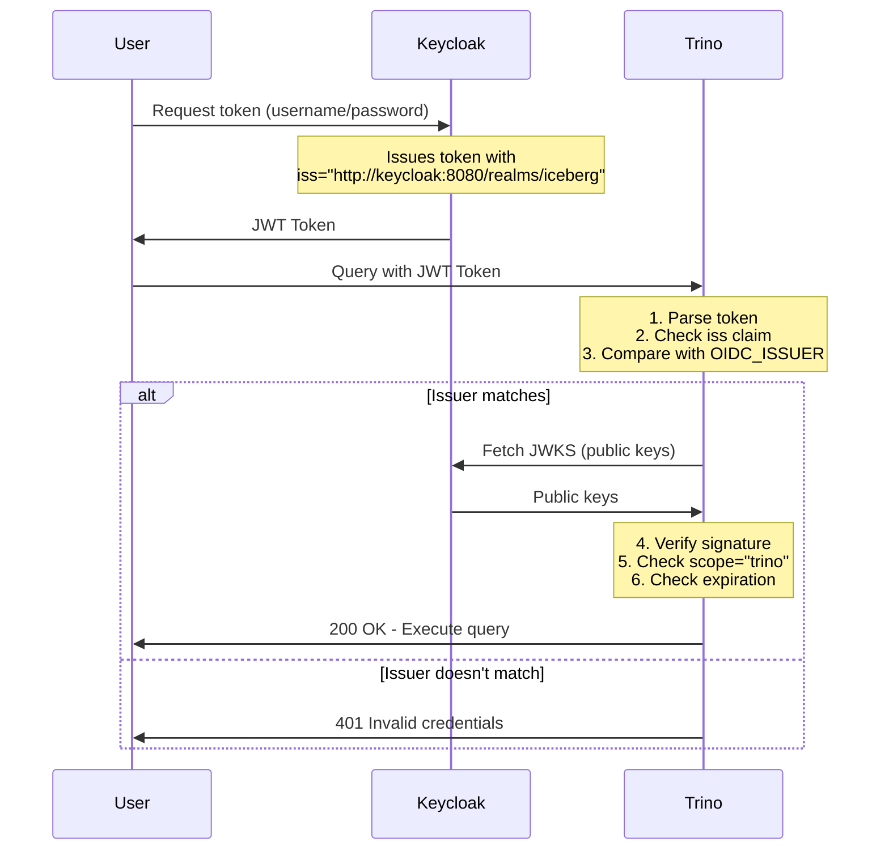

# OAuth2 & OIDC Configuration - Giải thích chi tiết

## 🔑 1. Client "trino" trong Keycloak

**Client** trong Keycloak đại diện cho một **ứng dụng** muốn sử dụng Keycloak để authenticate users.

### Vai trò của Client "trino"

```
┌──────────────┐         ┌──────────────┐         ┌──────────────┐
│   User       │  Login  │  Keycloak    │  Token  │   Trino      │
│   (hung)     │────────>│  (IdP)       │────────>│  (Client)    │
└──────────────┘         └──────────────┘         └──────────────┘
                               ▲                         ▲
                               │                         │
                         Client ID: trino         Validates token
                         Client Secret: AK48...
```

### Cấu hình quan trọng của Client "trino"

1. **Client ID**: `trino`

   - Định danh duy nhất của ứng dụng trong Keycloak
   - Được sử dụng khi request token: `client_id=trino`

2. **Client Secret**: `AK48QgaKsqdEpP9PomRJw7l2T7qWGHdZ`

   - "Mật khẩu" của client để authenticate với Keycloak
   - Chỉ dùng cho **Confidential Clients** (backend applications)

3. **Client Protocol**: `openid-connect`

   - Sử dụng OpenID Connect (OAuth2 + Identity layer)

4. **Access Type**: Confidential

   - Client có thể giữ bí mật (secret) an toàn
   - Phù hợp cho backend services như Trino

5. **Valid Redirect URIs**:

   - URLs mà Keycloak có thể redirect sau khi login
   - VD: `https://trino-proxy:443/oauth2/callback`

6. **Direct Access Grants Enabled**: ON
   - Cho phép **Resource Owner Password Credentials (ROPC)** flow
   - User có thể login bằng username/password trực tiếp (không cần browser)

### Ví dụ: Request token với Client "trino"

```bash
curl -X POST 'http://keycloak:8080/realms/iceberg/protocol/openid-connect/token' \
  -d 'grant_type=password' \
  -d 'client_id=trino' \              # ← Client ID
  -d 'client_secret=AK48...' \        # ← Client Secret
  -d 'username=hung' \
  -d 'password=hung' \
  -d 'scope=trino'
```

---

## 📦 2. Client Scope "trino" trong Keycloak

**Client Scope** định nghĩa **quyền/permissions** mà token sẽ có.

### Tại sao cần Client Scope "trino"?

Trino yêu cầu token phải có **scope "trino"** để accept authentication:

```properties
# trino/etc/config.properties
http-server.authentication.oauth2.scopes=trino
```

Nếu token không có scope "trino" → Trino reject với 401.

### Token có và không có scope "trino"

#### ❌ KHÔNG có scope "trino":

```json
{
  "iss": "http://keycloak:8080/realms/iceberg",
  "aud": ["account"],
  "scope": "email profile", // ← Chỉ có email, profile
  "preferred_username": "hung"
}
```

→ Trino reject: 401 Invalid credentials

#### ✅ CÓ scope "trino":

```json
{
  "iss": "http://keycloak:8080/realms/iceberg",
  "aud": ["trino", "account"], // ← trino trong audience
  "scope": "email profile trino", // ← CÓ "trino" trong scope
  "preferred_username": "hung"
}
```

→ Trino accept: 200 OK

### Cấu hình Client Scope "trino"

Khi tạo Client Scope "trino" trong Keycloak:

1. **Name**: `trino`
2. **Protocol**: `openid-connect`
3. **Include in token scope**: **ON** ⚠️ QUAN TRỌNG!

   - Nếu OFF: scope "trino" sẽ KHÔNG xuất hiện trong token
   - Nếu ON: scope "trino" sẽ có trong token.scope

4. **Mappers**:

   - **Audience Mapper**: Thêm "trino" vào `aud` claim
     - Mapper Type: Audience
     - Included Client Audience: trino
     - Add to access token: ON

5. **Assigned to Client**:
   - Client Scope "trino" phải được add vào Client "trino"
   - Dạng: **Default Client Scope** (tự động include khi request token)

### Flow request scope

```
User requests token with scope=trino
        ↓
Keycloak checks Client Scope "trino" exists
        ↓
Include "trino" in token.scope
        ↓
Token: { "scope": "email profile trino", "aud": ["trino", "account"] }
```

---

## 🏢 3. OIDC_ISSUER - Issuer URL

**Issuer** là **URL định danh của Identity Provider** (Keycloak).

### Khái niệm

```
OIDC_ISSUER = "http://keycloak:8080/realms/iceberg"
```

- **Issuer**: Tổ chức/service phát hành token
- Đây là **unique identifier** của Keycloak realm
- Được embed vào mỗi JWT token trong claim `iss`

### Vai trò của OIDC_ISSUER

#### 1. **Token Verification** (Quan trọng nhất!)

Khi Trino nhận JWT token, nó sẽ:

```python
# Pseudo code
received_token = parse_jwt(access_token)
received_issuer = received_token['iss']

expected_issuer = OIDC_ISSUER  # From config

if received_issuer != expected_issuer:
    raise AuthenticationError("Invalid issuer!")
```

**Token:**

```json
{
  "iss": "http://keycloak:8080/realms/iceberg" // ← Must match OIDC_ISSUER
}
```

**Trino config:**

```yaml
environment:
  - OIDC_ISSUER=http://keycloak:8080/realms/iceberg # ← Must match token.iss
```

❌ **Nếu không khớp:**

```
Token: "iss": "http://keycloak:8080/realms/iceberg"
Config: OIDC_ISSUER=http://localhost:30080/realms/iceberg

→ com.nimbusds.jwt.proc.BadJWTException: JWT iss claim has value
   http://keycloak:8080/realms/iceberg, must be
   http://localhost:30080/realms/iceberg
```

#### 2. **JWKS Discovery**

OIDC_ISSUER được dùng để tìm public keys để verify JWT signature:

```
OIDC_ISSUER + "/.well-known/openid-configuration"
→ http://keycloak:8080/realms/iceberg/.well-known/openid-configuration

Response:
{
  "issuer": "http://keycloak:8080/realms/iceberg",
  "jwks_uri": "http://keycloak:8080/realms/iceberg/protocol/openid-connect/certs",
  "token_endpoint": "http://keycloak:8080/realms/iceberg/protocol/openid-connect/token",
  ...
}
```

Trino fetch public keys từ `jwks_uri` để verify token signature.

#### 3. **Security - Man-in-the-Middle Protection**

Issuer verification prevents token từ **rogue Identity Provider**:

```
Attacker creates fake Keycloak:
  Fake Issuer: "http://evil-keycloak:8080/realms/iceberg"
  Issues token: {"iss": "http://evil-keycloak:8080/realms/iceberg"}

Trino receives token:
  Expected: "http://keycloak:8080/realms/iceberg"
  Received: "http://evil-keycloak:8080/realms/iceberg"

→ REJECT! Issuers don't match
```

### OIDC_ISSUER phải dùng URL nào?

#### ❌ SAI: `http://localhost:30080/realms/iceberg`

- `localhost` chỉ work khi access từ **host machine**
- Keycloak trong Docker có hostname là `keycloak` (không phải localhost)
- Token được issue từ `keycloak` container → `iss` claim sẽ là hostname của Keycloak service

#### ✅ ĐÚNG: `http://keycloak:8080/realms/iceberg`

- Sử dụng **Docker service name** (`keycloak`)
- Match với token.iss claim
- Trino có thể resolve `keycloak` hostname trong Docker network

### Tóm tắt Flow



---

## 📋 Checklist để ROPC Flow hoạt động

### 1. ✅ Keycloak Configuration

- [ ] Client "trino" exists
- [ ] Client "trino" has **Direct Access Grants Enabled**
- [ ] Client Scope "trino" exists
- [ ] Client Scope "trino" has **Include in token scope = ON**
- [ ] Client Scope "trino" assigned to Client "trino" as **Default**
- [ ] Client Scope "trino" has **Audience Mapper** với audience="trino"

### 2. ✅ Trino Configuration

```properties
# trino/etc/config.properties
http-server.authentication.type=oauth2
http-server.authentication.oauth2.issuer=${ENV:OIDC_ISSUER}
http-server.authentication.oauth2.scopes=trino              # ← Yêu cầu scope
http-server.authentication.oauth2.principal-field=preferred_username
```

```yaml
# docker-compose-trino.yaml
environment:
  - OIDC_ISSUER=http://keycloak:8080/realms/iceberg # ← Must match token.iss
```

### 3. ✅ Python Code

```python
# Request token WITH scope=trino
response = requests.post(
    "http://keycloak:8080/realms/iceberg/protocol/openid-connect/token",
    data={
        "grant_type": "password",
        "client_id": "trino",
        "client_secret": "AK48QgaKsqdEpP9PomRJw7l2T7qWGHdZ",
        "username": "hung",
        "password": "hung",
        "scope": "trino"                                      # ← MUST include!
    }
)

# Verify token has scope
token = response.json()["access_token"]
decoded = decode_jwt(token)
assert "trino" in decoded["payload"]["scope"].split()       # ← Check!
assert decoded["payload"]["iss"] == "http://keycloak:8080/realms/iceberg"  # ← Check!

# Connect to Trino
conn = connect(
    host="trino-proxy",
    port=443,
    user="hung",
    auth=JWTAuthentication(token),
    http_scheme="https",
    verify=False,
)
```

### 4. ✅ RBAC Policy

```sql
-- User must have at least one policy
SELECT * FROM policy WHERE username = 'hung';
-- Should return at least 1 row
```

---

## 🔍 Debug Checklist

Nếu gặp 401 error:

1. **Check token scope:**

   ```python
   decoded = decode_jwt(access_token)
   print(decoded['payload']['scope'])
   # Must contain "trino"
   ```

2. **Check token issuer:**

   ```python
   print(decoded['payload']['iss'])
   # Should be: http://keycloak:8080/realms/iceberg
   ```

3. **Check Trino config:**

   ```bash
   docker exec trino-opa env | grep OIDC_ISSUER
   # Should be: OIDC_ISSUER=http://keycloak:8080/realms/iceberg
   ```

4. **Check Trino logs:**

   ```bash
   docker logs trino-opa 2>&1 | Select-String "BadJWTException"
   # Should have no errors
   ```

5. **Check OPA logs:**

   ```bash
   docker logs opa | Select-String "ExecuteQuery"
   # Should return {"result":true}
   ```

6. **Check RBAC policies:**
   ```bash
   curl http://rbac-api:8000/users/hung/policies
   # Should return at least one policy
   ```

---

## 📚 Tài liệu tham khảo

- OAuth2 RFC: https://datatracker.ietf.org/doc/html/rfc6749
- OpenID Connect: https://openid.net/specs/openid-connect-core-1_0.html
- Trino OAuth2: https://trino.io/docs/current/security/oauth2.html
- Keycloak Docs: https://www.keycloak.org/docs/latest/securing_apps/
